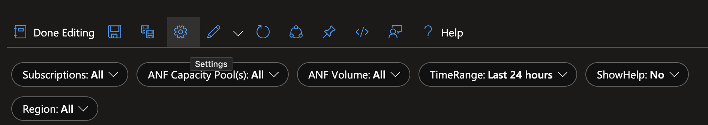
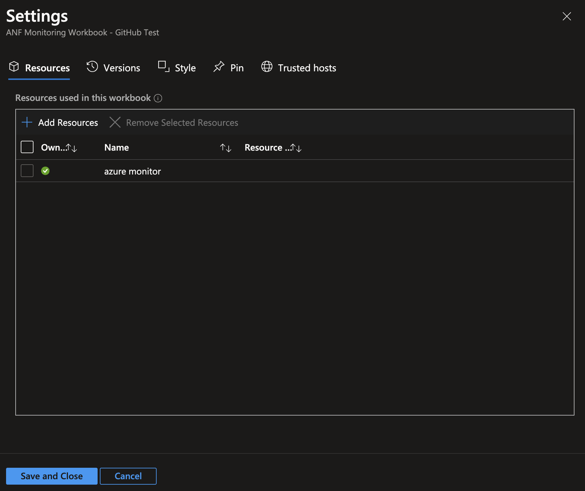

# Azure NetApp Files Monitoring Workbook

## Overview
This workbook has been created as an example of how users can monitor and visualise their Azure NetApp Files resources. More information on how to setup and configure Azure Workbooks can be found here [Azure Workbooks](https://learn.microsoft.com/en-gb/azure/azure-monitor/visualize/workbooks-overview?WT.mc_id=Portal-fx).

### Change Log

* July 18, 2024 - Uploaded ANF Monitoring Workbook v1.0

## Disclaimer
ANF Monitoring Working is provided as is and is not supported by NetApp or Microsoft. You are encouraged to modify to fit your specific environment and/or requirements. It is strongly recommended to test the functionality before deploying to any business critical or production environments.

## Getting started 

Please use the button below to redirect you to the Azure portal and the deployment of the ARM template.

Once that is set up, go to the workbook and open it. In order to monitor your Azure NetApp Files resources, you will need to add your subscriptions to the workbook. 

1. Open workbook
2. Go into Edit mode
3. On the top options, go into settings.

4. Add the subscriptions to resources used in this workbook.

5. Save and close

## Need help?
Please open an issue here on GitHub and I will try to assist as my schedule permits.

## Feedback
We are happy to hear your feedback. If you find this useful, please share and/or say hello on social media.

## Kudos
This workbook was developed with the help of Yaiza Rosales and Anthony Mashford. 💙

